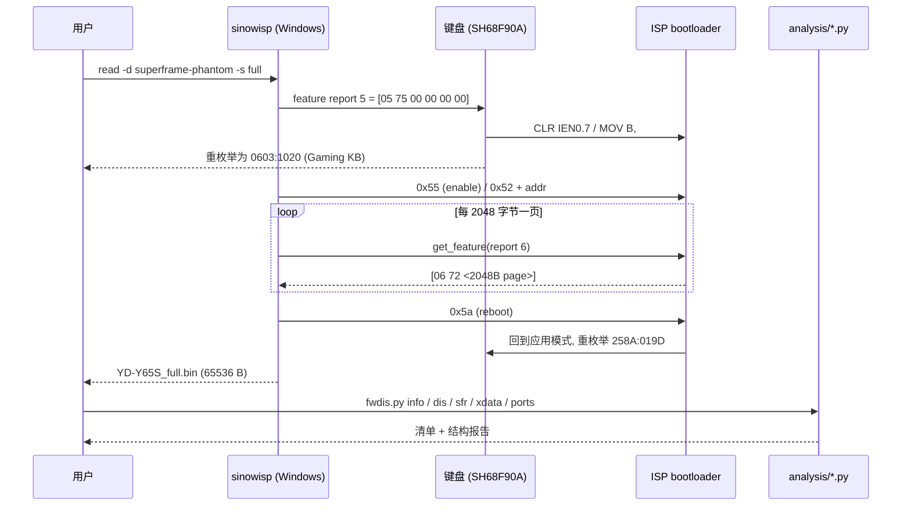
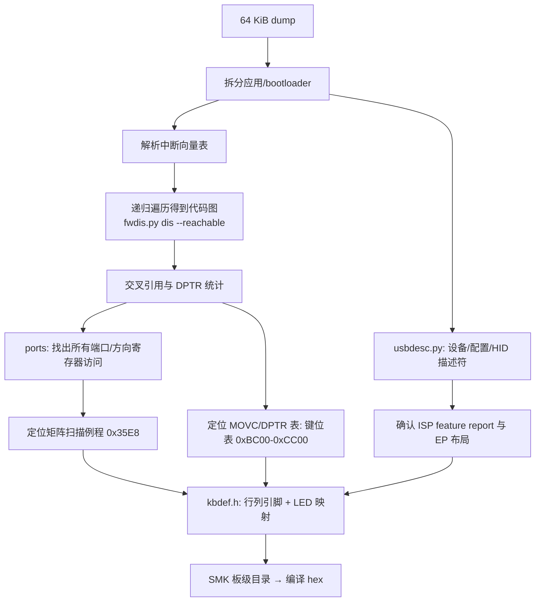
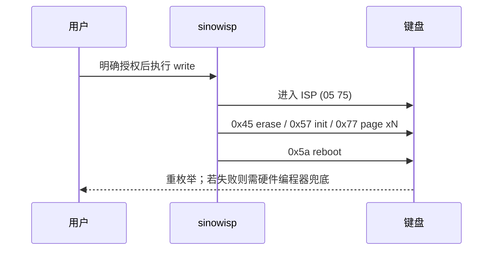

# Key flows

## 核心流程：从一台键盘到一份可分析的固件

```mermaid
sequenceDiagram
    participant U as 用户
    participant T as sinowisp (Windows)
    participant K as 键盘 (SH68F90A)
    participant B as ISP bootloader
    participant A as analysis/*.py

    U->>T: read -d superframe-phantom -s full
    T->>K: feature report 5 = [05 75 00 00 00 00]
    K->>B: CLR IEN0.7 / MOV B,#A5 / MOV A,#5A / LJMP 0xFF00
    K-->>U: 重枚举为 0603:1020 (Gaming KB)
    T->>B: 0x55 (enable) / 0x52 + addr
    loop 每 2048 字节一页
        T->>B: get_feature(report 6)
        B-->>T: [06 72 <2048B page>]
    end
    T->>B: 0x5a (reboot)
    B->>K: 回到应用模式, 重枚举 258A:019D
    T-->>U: YD-Y65S_full.bin (65536 B)
    U->>A: fwdis.py info / dis / sfr / xdata / ports
    A-->>U: 清单 + 结构报告
```

## 分析流程：从 dump 到可移植的硬件档案

```mermaid
flowchart TD
  D[64 KiB dump] --> S[拆分应用/bootloader]
  S --> V[解析中断向量表]
  V --> C[递归遍历得到代码图<br/>fwdis.py dis --reachable]
  C --> X[交叉引用与 DPTR 统计]
  X --> P[ports: 找出所有端口/方向寄存器访问]
  P --> M[定位矩阵扫描例程 0x35E8]
  X --> T[定位 MOVC/DPTR 表: 键位表 0xBC00-0xCC00]
  S --> U[usbdesc.py: 设备/配置/HID 描述符]
  U --> H[确认 ISP feature report 与 EP 布局]
  M --> K[kbdef.h: 行列引脚 + LED 映射]
  T --> K
  H --> K
  K --> SMK[SMK 板级目录 → 编译 hex]
```

## 写入流程（**需明确许可**，当前不执行）

```mermaid
sequenceDiagram
    participant U as 用户
    participant T as sinowisp
    participant K as 键盘
    U->>T: 明确授权后执行 write
    T->>K: 进入 ISP (05 75)
    T->>K: 0x45 erase / 0x57 init / 0x77 page xN
    T->>K: 0x5a reboot
    K-->>U: 重枚举；若失败则需硬件编程器兜底
```
